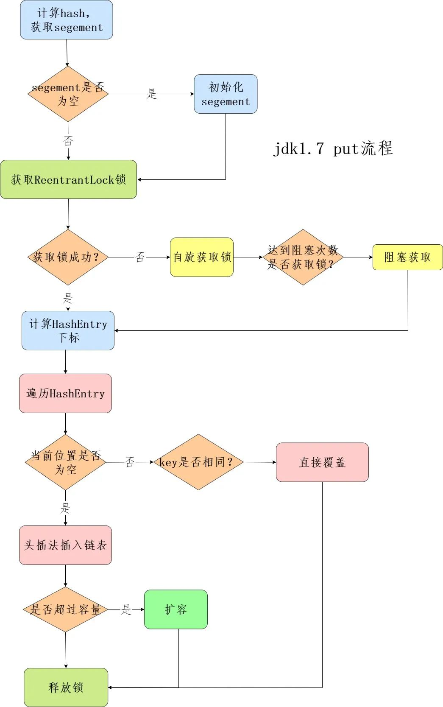

- [List 、Set、 Map有什么区别和联系](#list-set-map有什么区别和联系)
- [集合中接口和类的关系](#集合中接口和类的关系)
  - [Iterator：所有集合类都实现了Iterator接口](#iterator所有集合类都实现了iterator接口)
- [层次图](#层次图)
- [List](#list)
- [Set](#set)


### List 、Set、 Map有什么区别和联系

- list 和set 有共同的父类 它们的用法也是一样的 唯一的不太就是set中不能有相同的元素 list中可以，list是有序集合
- list和set的用途非常广泛 list可以完全代替数组来使用
- map是独立的集合，它使用键值对的方式来储存数据，键不能有重复的

### 集合中接口和类的关系
- Collection接口是集合类的根接口，Java中没有提供这个接口的直接实现类。但是却让它被继承，产生了两个接口，就是Set和List。
- Map是另一个接口，与Collection是相互独立的

#### Iterator：所有集合类都实现了Iterator接口
  1. 用于遍历集合元素，主要有三个方法
- hasNext()是否有下一个元素
- next()返回下一个元素
- remove()删除当前元素
### 层次图


### List

#### ArrayList  

1、 最常用集合：ArrayList  </br>
 特点：ArrayList集合中元素存储的位置是连续的，所以查询起来会比较快捷，但是执行插入删除操作会比较麻烦一点，会引起其他元素位置的变化。
 注意：list中储存的是对象引用，而不是对象本身，如果对象变化，list中储存的也会变。

 ```Java
    User user = new User(1, "迪丽热巴", 18, new Date());
    List<User> userList = new ArrayList<User>();
    userList.add(user);
    System.out.println(userList); // [User(id=1, username=迪丽热巴, ...)]
    user.setUsername("德玛西亚");
    System.out.println(userList); // [User(id=1, username=德玛西亚, ...)]
 ```
#### LinkedList  

2、与最常用集合相反的集合：LinkedList  </br>
LinkedList与ArrayList是互补的，所以ArrayList的优点就是LinkedList的缺点，ArrayList的缺点就是LinkedList的优点。 </br>
特点：LinkedList中元素位置是任意的，所以执行插入删除操作效率较高，查询效率较低。

LinkedList要头部插入才能体现它的效率
```Java
    LinkedList<Integer> linkedList = new LinkedList<>();
        long linkedStart = System.currentTimeMillis();
        for (int i = 0; i < 1000000; i++) {
            linkedList.addFirst(i);
        }
```

- 在尾部插入数据，数据量较小时LinkedList比较快，因为`ArrayList要频繁扩容`，当数据量大时ArrayList比较快，因为ArrayList`扩容是当前容量*1.5`，大容量扩容一次就能提供很多空间，当ArrayList不需扩容时效率明显比LinkedList高，因为直接数组元素赋值不需new Node
- 在首部插入数据，LinkedList较快，因为LinkedList遍历插入位置花费时间很小，而ArrayList需要将原数组所有元素进行一次System.arraycopy
- 插入位置越往后，ArrayList效率越高，因为数组需要复制后移的数据少了，那么System.arraycopy就快了，因此在首部插入数据LinkedList效率比ArrayList高，尾部插入数据ArrayList效率比LinkedList高

3、与一般集合都相反的集合：Vector </br>
特点：多个线程同时访问不会发生不确定的结果，但是它的效率会比较低，如果要考虑线程安全的话可以用它。

#### Vector(不推荐)

1、使用 synchronized 保证线程安全

**不推荐理由**

- 使用synchronized 效率低，同时只能在尾部进行增加和删除。
- Vector空间满了之后，扩容的是一倍
- Vector分配内存的时候需要连续的存储空间，如果数据太多，容易造成内存分配失败

#### CopyOnWriteArrayList

Juc包下的CopyOnWriteArrayList就可以解决线程不安全的问题。
具体的add、get方法如下：

```java
public boolean add(E e) {
    final ReentrantLock lock = this.lock;
    lock.lock();
    try {
        Object[] elements = getArray();
        int len = elements.length;
        //复制一个新的数组
        Object[] newElements = Arrays.copyOf(elements, len + 1);
        //在新数组上添加元素
        newElements[len] = e;
        //将原来的容器引用到新数组
        setArray(newElements);
        return true;
    } finally {
        lock.unlock();
    }
}

public E get(int index) {
    return get(getArray(), index);
}

private E get(Object[] a, int index) {
    return (E) a[index];
}
```

CopyOnWriteArraylist使用的是读写分离的策略，即写入数据的时候，将数据复制一份，在新的副本上执行操作，完成后将原容器的引用指向新的容器。在写入的过程中，读取会读取旧容器的元素，不会抛出并发异常。同时，写入时会加lock锁，多个线程写入也不会出现并发异常。


---

### Set

#### HashSet

1、Set中最常用的集合：HashSet  </br>
HashSet是使用Hash表实现的，底层其实是一个HashMap容器,集合里面的元素是无序得，可以有null值，但是不能有重复元素。</br>
特点：因为相同的元素具有相同的hashCode，所以不能有重复元素

#### TreeSet

2、Set中第二常用的集合：TreeSet

底层是基于`TreeMap`来实现的，所以底层结构也是红黑树。因为结构是红黑树，所以每次插入都会遍历比较来寻找节点插入位置，如果发现某个节点的值是一样的那就会直接覆盖。实现Comparable保证元素有序

特点：集合中的元素是有顺序得，不允许放入null，同样不能放入重复元素。

#### LinkedHashSet

1. LinkedHashSet是HashSet的子类

2. LinkedHashSet底层是一个LinkedHashMap,底层维护了一个数组 + 双向链表

3. LinkedHashSet根据元素的hashCode值来决定元素的存储位置，同时使用链表维护元素的次序，这使得元素看起来是以插入顺序保存的

4. LinkedHashSet不允许添加重复元素

   **添加元素详解**

   1. 在LInkedHashSet中维护了一个`hash表和双向链表`，LinkedHashSet中有head和tail,分别指向链表的头和尾

   2. 每一个节点有before和after属性，这样可以形成双向链表

   3. 在添加一个元素时，先求hash值，再求索引，确定该元素在table表中的位置，然后将添加的元素加入到双向链表（如果该元素已经存在，则不添加）

      tail.next = newElement

      newElement.pre = tail

   4. 这样在遍历LinkedHashSet时也能确保插入顺序和遍历顺序一致

---

### Map

#### HashMap

1.7之前是 数组 + 链表，1.8之后是 `数组 + 链表 + 红黑树`

数据结构示意图如下：


- 数据元素通过映射关系，也就是散列函数，映射到桶数组对应索引的位置
- 如果发生冲突，从冲突的位置拉一个链表，插入冲突的元素
- 如果链表长度>8&数组大小>=64，链表转为红黑树
- 如果红黑树节点个数<6 ，转为链表

##### **你对红黑树了解多少？为什么不用二叉树/平衡树呢？**

红黑树本质上是一种二叉查找树，为了保持平衡，它又在二叉查找树的基础上增加了一些规则：

1.每个节点要么是红色的，要么是黑色的

2.根节点永远是黑色的

3.所有的叶子节点都是是黑色的（注意这里说叶子节点其实是最后一个 节点）；

> 之所以不用二叉树

红黑树是一种平衡的二叉树，插入、删除、查找的最坏时间复杂度都为 O(logn)，避免了二叉树最坏情况下的O(n)时间复杂度。

##### **红黑树怎么保持平衡的知道吗？**

红黑树有两种方式保持平衡：`旋转`和`染色`。

##### HashMap的put流程知道吗？


##### **HashMap怎么查找元素的呢？**

1. 使用扰动函数，获取新的哈希值
2. 计算数组下标，获取节点
3. 当前节点和key匹配，直接返回
4. 否则，当前节点是否为树节点，查找红黑树
5. 否则，遍历链表查找

##### **HashMap的哈希/扰动函数是怎么设计的?**

HashMap的哈希函数是先拿到 key 的hashcode，是一个32位的int类型的数值，然后让hashcode的高16位和低16位进行异或操作。

```java
int h;
// key的hashCode和key的hashCode右移16位做异或运算
return (key == null) ? 0 : (h = key.hashCode()) ^ (h >>> 16);
```

##### **有什么办法能解决HashMap线程不安全的问题呢？**

Java 中有 HashTable、Collections.synchronizedMap、以及 ConcurrentHashMap 可以实现线程安全的 Map。

- **HashTable** 是直接在操作方法上加 synchronized 关键字，锁住整个table数组，粒度比较大；
- **Collections.synchronizedMap** 是使用 Collections 集合工具的内部类，通过传入 Map 封装出一个 SynchronizedMap 对象，内部定义了一个对象锁，方法内通过对象锁实现；
- **ConcurrentHashMap** 在jdk1.7中使用分段锁，在jdk1.8中使用`CAS+synchronized`。

#### ConcurrentHashMap

ConcurrentHashmap线程安全在jdk1.7版本是基于`分段锁`实现，在jdk1.8是基于`CAS+synchronized`实现。

##### **1.7分段锁**

从结构上说，1.7版本的ConcurrentHashMap采用分段锁机制，里面包含一个Segment数组，Segment继承于ReentrantLock，Segment则包含HashEntry的数组，HashEntry本身就是一个链表的结构，具有保存key、value的能力能指向下一个节点的指针。

实际上就是相当于每个Segment都是一个HashMap，默认的Segment长度是16，也就是支持16个线程的并发写，Segment之间相互不会受到影响。

**put流程**

整个流程和HashMap非常类似，只不过是先定位到具体的Segment，然后通过ReentrantLock去操作而已，后面的流程，就和HashMap基本上是一样的。

1. 计算hash，定位到segment，segment如果是空就先初始化
2. 使用ReentrantLock加锁，如果获取锁失败则尝试自旋，自旋超过次数就阻塞获取，保证一定获取锁成功
3. 遍历HashEntry，就是和HashMap一样，数组中key和hash一样就直接替换，不存在就再插入链表，链表同样操作



##### **1.8CAS+synchronized**

**put 流程**

1. 首先计算hash，遍历node数组，如果node是空的话，就通过CAS+自旋的方式初始化
2. 如果当前数组位置是空则直接通过CAS自旋写入数据
3. 如果hash==MOVED，说明需要扩容，执行扩容
4. 如果都不满足，就使用synchronized写入数据，写入数据同样判断链表、红黑树，链表写入和HashMap的方式一样，key hash一样就覆盖，反之就尾插法，链表长度超过8就转换成红黑树


#### LinkedHashMap、TreeMap

##### **LinkedHashMap 怎么实现有序的**

LinkedHashMap维护了一个双向链表，有头尾节点，同时 LinkedHashMap 节点 Entry 内部除了继承 HashMap 的 Node 属性，还有 before 和 after 用于标识前置节点和后置节点。`可以实现按插入的顺序或访问顺序排序。`

##### **TreeMap 怎么实现有序的？**

TreeMap 是按照 Key 的`自然顺序`或者 `Comprator 的顺序`进行排序，内部是通过红黑树来实现。所以要么 key 所属的类实现 Comparable 接口，或者自定义一个实现了 Comparator 接口的比较器，传给 TreeMap 用于 key 的比较。

---

### Queue

