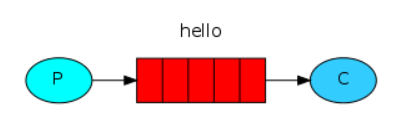
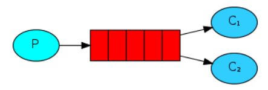
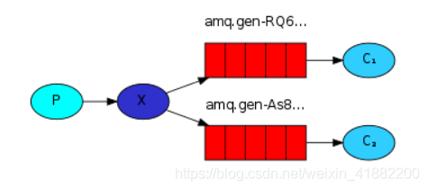
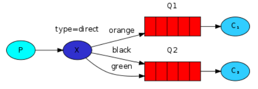
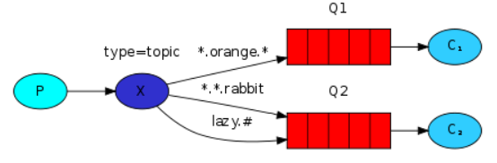
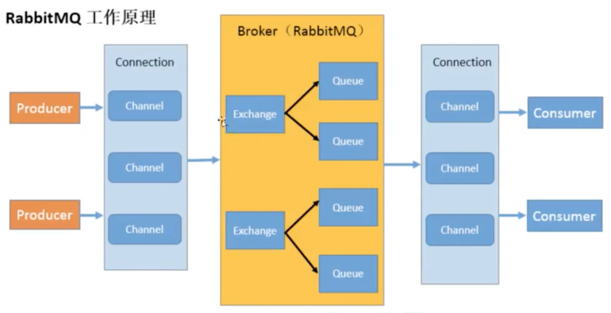

## 消息队列

### 什么是MQ

RabbitMQ 是一个消息中间件：它接受并转发消息。你可以把它当做一个快递站点，当你要发送一个包

裹时，你把你的包裹放到快递站，快递员最终会把你的快递送到收件人那里，按照这种逻辑 RabbitMQ 是

一个快递站，一个快递员帮你传递快件。RabbitMQ 与快递站的主要区别在于，它不处理快件而是接收，

存储和转发消息数据。

### 四大核心概念

> 生产者

- 产生数据发送消息的程序

> 交换机

- 一方面它接收来自生产者的消息，另一方面它将消息推送到队列中
- 交换机必须确切知道如何处理它接收到的消息，是将这些消息推送到特定队列还是推送到多个队列，亦或者是把消息丢弃，这个得有交换机类型决定

>队列

- 本质上是一个大的消息缓冲区。许多生产者可以将消息发送到一个队列，许多消费者可以尝试从一个队列接收数据

> 消费者

- 消费者大多时候是一个等待接收消息的程序

### RabbitMQ 核心部分 （工作模式）

1. **简单队列**

​	

一个生产者对应一个消费者！！

	2. **work模式**

 

一个生产者对应多个消费者，但是一条消息只能有一个消费者获得消息！！！
**轮询**分发就是将消息队列中的消息，依次发送给所有消费者。一个消息只能被一个消费者获取。

	3. **发布/订阅模式**

​	

​		一个消费者将消息首先发送到**交换器**，交换器绑定到多个队列，然后被监听该队列的消费者所接收并消费。

​		ps:X表示交换器，在RabbitMQ中，交换器主要有四种类型:direct、fanout、topic、headers，这里的交换器是 fanout。

​		两个消费者获得了同一条消息。即就是，一个消息从交换机同时发送给了两个队列中，监听这两个队列的消费者消费了这个消息；
如果没有队列绑定交换机，则消息将丢失。因为交换机没有存储能力，消息只能存储在队列中。

- **direct**: 如果路由键完全匹配的话，消息才会被投放到相应的队列。
- **fanout**: 当发送一条消息到fanout交换器上时，它会把消息投放到所有附加在此交换器上的队列。
- **topic**: 设置模糊的绑定方式，“*”操作符将“.”视为分隔符，匹配单个字符；“#”操作符没有分块的概念，它将任意“.”均视为关键字的匹配部分，能够匹配多个字符。
- **header**: headers 交换器允许匹配 AMQP 消息的 header 而非路由键，除此之外，header 交换器和 direct 交换器完全一致，但是性能却差很多，因此基本上不会用到该交换器

	4. **路由模式**

​	

​		生产者将消息发送到direct交换器，在绑定队列和交换器的时候有一个路由key，生产者发送的消息会指定一个路由key，那么消息只会发送到相应key相同的队列，接着监听该队列的消费者消费消息。

​		也就是让消费者有选择性的接收消息。
​		路由模式，是以路由规则为导向，引导消息存入符合规则的队列中。再由队列的消费者进行消费的。

 5. **主题模式**

     

​		上面的路由模式是根据路由key进行完整的匹配（完全相等才发送消息），这里的通配符模式通俗的来讲就是模糊匹配。

符号“#”表示匹配一个或多个词，符号“*”表示匹配一个词。
　　与路由模式相似，但是，主题模式是一种模糊的匹配方式。


### 各个名词介绍

 

**Broker**：接收和分发消息的应用，RabbitMQ Server 就是 Message Broker

**Virtual host**：出于多租户和安全因素设计的，把 AMQP 的基本组件划分到一个虚拟的分组中，类似于网络中的 namespace 概念。当多个不同的用户使用同一个 RabbitMQ server 提供的服务时，可以划分出多个 vhost，每个用户在自己的 vhost 创建 exchange／queue 等

**Connection**：publisher／consumer 和 broker 之间的 TCP 连接

**Channel**：如果每一次访问 RabbitMQ 都建立一个 Connection，在消息量大的时候建立 TCP Connection 的开销将是巨大的，效率也较低。Channel 是在 connection 内部建立的逻辑连接，如果应用程序支持多线程，通常每个 thread 创建单独的 channel 进行通讯，AMQP method 包含了 channel id 帮助客户端和 message broker 识别 channel，所以 channel 之间是完全隔离的。**Channel 作为轻量级的 Connection  **极大减少了操作系统建立 **TCP connection** **的开销** 

**Exchange**：message 到达 broker 的第一站，根据分发规则，匹配查询表中的 routing key，分发消息到 queue 中去。常用的类型有：direct (point-to-point), topic (publish-subscribe) and fanout(multicast)

**Queue**：消息最终被送到这里等待 consumer 取走

**Binding**：exchange 和 queue 之间的虚拟连接，binding 中可以包含 routing key，Binding 信息被保

存到 exchange 中的查询表中，用于 message 的分发依据


### 安装

```shell
docker run -d --hostname my-rabbit --name rabbit -p 15672:15672 -p 5673:5672 rabbitmq
```


## 发布、消费


### 依赖

```xml
<!--rabbitmq 依赖客户端-->
<dependency>
	<groupId>com.rabbitmq</groupId>
	<artifactId>amqp-client</artifactId>
	<version>5.8.0</version>
</dependency>
```


### **消息生产者**

```java
public class Producer {
    private final static String QUEUE_NAME = "hello";

    public static void main(String[] args) throws Exception {
        //创建一个连接工厂
        ConnectionFactory factory = new ConnectionFactory();
        factory.setHost("119.91.204.244");
        //channel 实现了自动 close 接口 自动关闭 不需要显示关闭
        try (Connection connection = factory.newConnection();
             Channel channel = connection.createChannel()) {
            /**
             * 生成一个队列
             * 1.队列名称
             * 2.队列里面的消息是否持久化 默认消息存储在内存中
             * 3.该队列是否只供一个消费者进行消费 是否进行共享 true 可以多个消费者消费
             * 4.是否自动删除 最后一个消费者端开连接以后 该队列是否自动删除 true 自动删除
             * 5.其他参数
             */
            channel.queueDeclare(QUEUE_NAME, true, false, false, null);

            //从控制台当中接受信息
            Scanner scanner = new Scanner(System.in);
            while (scanner.hasNext()) {
                String message = scanner.next();
                /**
                 * 发送一个消息
                 * 1.发送到那个交换机
                 * 2.路由的 key 是哪个
                 * 3.其他的参数信息 MessageProperties.PERSISTENT_TEXT_PLAIN 代表消息持久化
                 * 4.发送消息的消息体
                 */
                channel.basicPublish("", QUEUE_NAME, MessageProperties.PERSISTENT_TEXT_PLAIN, message.getBytes());
                System.out.println("发送消息完成:" + message);
            }
        }
    }
}
```

### **消息消费者**

```java
@Slf4j
public class Consumer {
    public static void main(String[] args) throws Exception {
        Channel channel = RabbitMqUtils.getChannel();
        log.info("C1 等待接收消息处理时间较短");
        DeliverCallback deliverCallback = (consumerTag, delivery) -> {
            String message = new String(delivery.getBody());
            log.info("C1接收到消息：{}", message);
            /**
             * 1.消息标记 tag
             * 2.是否批量应答未应答消息
             */
            channel.basicAck(delivery.getEnvelope().getDeliveryTag(), false);
        };
        CancelCallback cancelCallback = var -> System.out.println("取消消费");
        /**
         * 设置分发权重 0-公平分发 1-为不公平分发，谁消费快就多发
         */
        channel.basicQos(4);
        //采用手动应答
        boolean autoAck = false;
        channel.basicConsume(RabbitMqUtils.QUEUE_NAME, autoAck, deliverCallback, cancelCallback);

    }
}
```


## 保证消息可靠性

